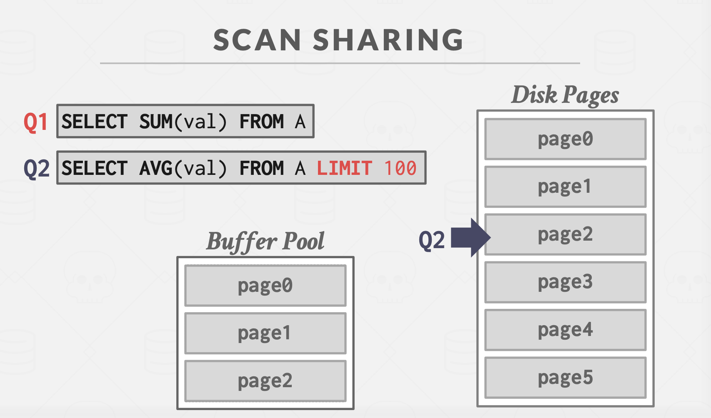

DBMS负责在内存和硬盘之间管理和移动数据。当引擎需要数据时，总是无需关心数据是如何加载的。理想情况下，数据应该就像已经在内存中。

另一个 等价的想法是：从时间和空间的控制去看。

对于空间的控制，我们是希望那些常常被一起使用的页在物理上的存储是紧临在一起的。

对于时间的控制，是指什么时候去从磁盘读取页和写入页到磁盘，最大限度地减少与磁盘的交互次数。

关于锁：Lock和Latch：
Locks: A lock is a higher-level, logical primitive that protects the contents of a database (e.g., tuples, tables, databases)
from other transactions. Transactions will hold a lock for its entire duration. Database systems can expose to the user
which locks are being held as queries are run. Locks need to be able to rollback changes.

Latches: A latch is a low-level protection primitive that the DBMS uses for the critical sections in its internal data
structures (e.g., hash tables, regions of memory). Latches are held for only the duration of the operation being made.
Latches do not need to be able to rollback changes

关于Page Directory和Page Table，如果已经完成了Project#1，应该能很容易理解。

对于分配策略，有Global Policies和Local Policies。

## 优化策略

### 多缓存池

The DBMS can maintain multiple buffer pools for different purposes.

### 预读取

The DBMS can also prefetch pages based on a query plan. Sequential Scans. Index Scans

### Scan Sharing

Also called synchronized scans.

如果两个查询都是针对同一组数据，If a query wants to scan a table and another query is already doing this, then the DBMS will attach the second query's cursor to the existing cursor.

这个也是有副作用的，如下图

Q1,Q2的数据集其实不一致，不能使用同步扫描

### Buffer Pool Bypass

缓存池旁路，有些数据无需被缓存，比如一些中间数据。只需要载入内存，使用后直接回收即可。

## OS Page Cache

Most DBMS use direct I/O to bypass the OS’s cache in order to avoid redundant copies of pages and having to manage different eviction policies.

**Postgres** is an example of a database system that uses the OS’s Page Cache.

## Buffer Replacement Policies

When the DBMS needs to free up a frame to make room for a new page, it must decide which page to evict from the buffer pool.

* LRU
* Clock
* LRU-K
* localization per query: The DBMS chooses which pages to evict on a per transaction/query basis. This minimizes the pollution of the buffer pool from each query.
* priority hints: allow transactions to tell the buffer pool whether page is important or not based on the context of each page during query execution.

LRU and CLOCK replacement policies are susceptible to sequential flooding.

A query performs a sequential scan that reads every page, This pollutes the buffer pool with pages that are read once and then never again.
