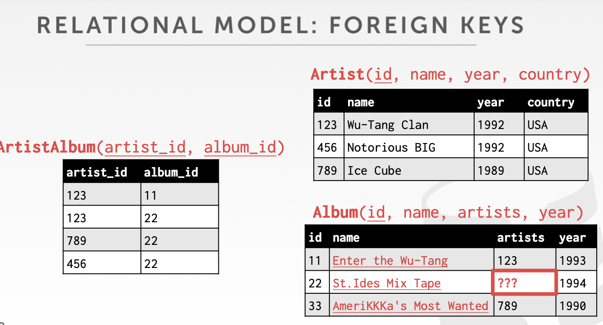
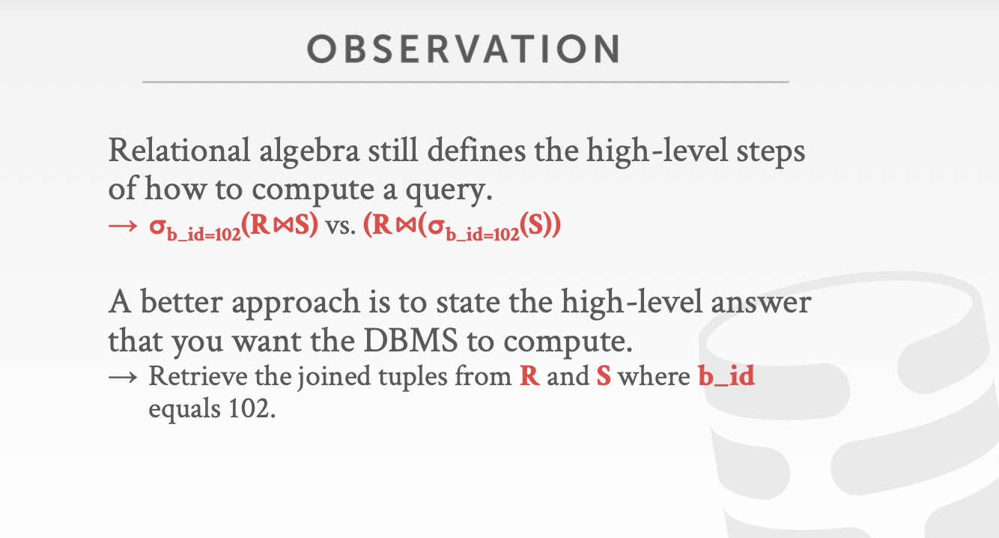
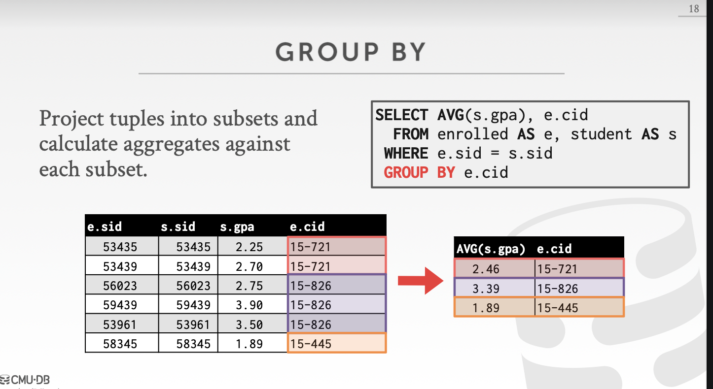

# Introduct Database

> * Five homework
> * Project: build your own database engine
> * tools: bustub

## Database

组织收集现实世界中的内在关系的模型

数据库关系对比文件式存储

A database management system (DBMS) is software that allows applications to store and analyze information in a database.
A general-purpose DBMS is designed to allow the definition, creation, querying, update, and administration of databases.

A data model is a collection of concepts for describing the data in a database.

A schema is a description of a particular collection of data, using a given data model.

Data Models:

* Relational: Most. sqlite, mysql
* Key/Value: redis
* Graph
* Document
* Matrix

## Relation model

一些属性

* Structure: 定义数据库的关系以及它们的内容
* Integrity: 保证数据库中的内容满足一定的限制（如外键
* Manipulation: 编程接口

**Relatio**是一个无序集合包含表示实体的属性关系(就是字段的集合)
**tuple**是a set of attribute values (also
known as its domain) in the relation（字段的值

n-ary Relation = tbale with n columns.

关系的**Primary Key**是一个唯一的标识对于单个tuple而言

**Foreign Keys**
A foreign key specifies that an attribute from one relation has to map to a tuple in another relation.

对于外键的使用一般会创建一个中间表。


## Data Manipulation Language (DML)

DML如果简单来说是对数据的增删改查，不涉及对表结构的修改。

这里有两种策略？方法？

Procedural：The query specifies the (high-level) strategy the DBMS should use to find the desired result. 让DBMS自己去决定如何找到数据结果（一般而言，DBMS是有优化的，所以一般采用这个） Relational Algebra

Non- Procedural：The query specifies only what data is wanted and not how to find it.这个不常用 Relational Calulus

需要完善

## Relational Algebra

看论文需要用

Fundamental operations to retrieve and manipulate tuples in a relation.
Each operator takes one or more relations as its inputs and outputs a new relation.

### Select

符号为$\sigma$，语法为:
$$
s\sigma_{predicate}(R)
$$

Choose a subset of the tuples from a relation that satisfies a selection predicate.

SQL语句

```sql
SELECT * FROM R WHERE a_id = 'a2';
```

描述为
$$
s\sigma_{a_id='a2'}(R)
$$

### Projection

投影
符号为

Generate a relation with tuples that contains only the specified attributes.
Can rearrange attributes’ ordering.
Can manipulate the values.

SQL语句

```sql
SELECT b_id-100, a_id FROM R WHERE a_id = 'a2';
```

### Union

联合

Generate a relation that contains all tuples that appear in either only one or both input relations.

语法为
$$
$$

SQL语句

```sql
(SELECT * FROM R) UNION ALL (SELECT * FROM S);
```

### Intersection

交集

SQL语句

```sql
(SELECT * FROM R) INTERSECT (SELECT * FROM S);
```

### Product

笛卡尔积

Generate a relation that contains all possible combinations of tuples from the input relations.

SQL语句

```sql
SELECT * FROM R CROSS JOIN S;
```

### JOIN

Generate a relation that contains all tuples that are a combination of two tuples (one from each input relation) with a common value(s) for one or more attributes.

```sql
SELECT * FROM R NATURAL JOIN S;
```

还有很多，不说了

最后讲一个查询例子


## SQL语法学习

### History

略

### Relation Language

* DML
* DDL Data Definition Language: 表相关
* DCL Data Control Language: 数据库权限控制相关

Important: SQL is based on bags (duplicates) not sets (no duplicates).
也就是说SQL允许重复tuple

### 基本语法介绍

```sql
SELECT name, gpa FROM student WHERE age > 25;
```

投影+select

```sql
SELECT s.name From enrolled As e, Student As s WHERE e.grade = 'A' AND e.cid = '15-721' AND e.sid = s.sid;
```

JOIN

### Aggregates

Functions that return a single value from a bag of
tuples:

* AVG(col): 返回该列的平均值
* MIN(col): 返回该列的最小值
* MAX(col)
* SUM(col)
* COUNT(col): 一般用COUNT(*)有优化

example

```sql
SELECT COUNT(login) AS cnt FROM student WHERE login LIKE '%@cs'
```

COUNT, SUM, AVG support DISTINCT

```sql
SELECT COUNT(DISTINCT login) AS cnt FROM student WHERE login LIKE '%@cs'
```

如果想获得每门课程学生的平均绩点，下面的例子会出错

```sql
SELECT AVG(s.gpa), e.cid FROM enrolled as e, student as s WHERE e.sid = s.cid;
```

原因是Output of other columns outside of an aggregate is undefined.


Non-aggregated values in SELECT output clause must appear in GROUP BY clause.
下面这个例子也是错误的

```sql
SELECT AVG(s.gpa), e.cid, X FROM enrolled AS e, student AS s
WHERE e.sid = s.sid GROUP BY e.cid, s.name;
```

如果相对聚合后的结果进行筛选，需要使用`HAVING`

最后一个例子，获得学生平均绩点大于3.9的课程

```sql
SELECT AVG(s.gpa) AS avg_gpa, e.cid FROM enrolled AS e, student AS s
WHERE e.sid = s.sid GROUP BY e.cid
HAVING AVG(s.gpa) > 3.9;
```

### 字符串操作

### 时间/日期操作

## 输出重定向output redirection

## NESTED QUERIES

子查询

```sql
SELECT name FROM student WHERE sid IN (SELECT sid FROM enrolled);
```

是否等价于

```sql
SELECT s.name FROM student AS s, enrolled AS e, WHERE s.sid = e.sid;
```

`SELECT name FROM student WHERE sid`为外部查询outer query

`SELECT sid FROM enrolled`为内部查询inter query

关键字

* ALL: 子查询必须完全满足外界条件Must satisfy expression for all rows in the sub-query
* ANY: 子查询有任意一行满足即可
* IN: 等价于ANY
* EXSITS: At least one row is returned.

Find student record with the highest id that is enrolled in at least one course.

```sql
SELECT MAX(e.sid), s.name
FROM enrolled AS e, student AS s
WHERE e.sid = s.sid;
```

错误的，如果改成分组聚合呢

采用子查询

```sql
SELECT sid, name
FROM sid IN (
    SELECT MAX(sid) FROM enrolled
);
```

Find all courses that have no students enrolled in it.

```sql
SELECT * FROM course WHERE N.N.OT. EXISTS(
    SELECT * FROM enrolled
    WHERE course.cid = enrolled.cid
);
```

## Window funtion

Performs a "sliding" calculation across a set of tuples that are related.
Like an aggregation but tuples are not grouped into a single output tuples.

```sql
SELECT ... FUNC_NAME(...) OVER (...) FROM TABLENAME
```

FUNC_NAME: 接收聚合函数和一些特殊函数
OVER: 定义如何分割数据

特殊函数:ROW_NUMBER()→ # of the current row, RANK()→ Order position of the current
row.

```sql
SELECT *, ROW_NUMBER() OVER () AS row_num FROM enrolled;
```

The OVER keyword specifies how to group together tuples when computing the window function.
Use `PARTITION BY`to specify group

```sql
SELECT cid, sid,
ROW_NUMBER() OVER (PARTITION BY cid)
FROM enrolled ORDER BY cid;
```

You can also include an ORDER BY in the window grouping to sort entries in each group.
这个我不太理解

```sql
SELECT *,
ROW_NUMBER() OVER (ORDER BY cid)
FROM enrolled ORDER BY cid;
```
