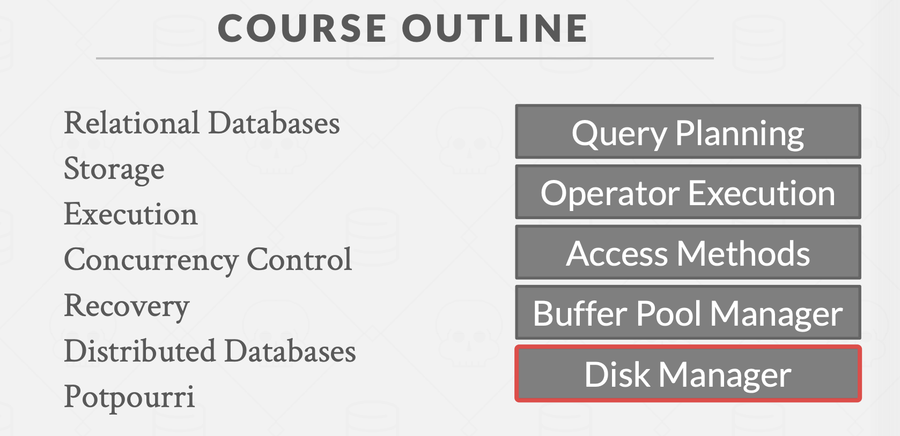

上图是课程大纲，这里关注一下右边。一步一步从底层到高层。现在是Disk Manager

这里仅仅关注"disk-orient"的DBMS架构，不关注面向内存的DBMS，如redis等。

## 磁盘的架构层级

Volatile Devices: 易失性存储设备，掉电即丧失内部存储的数据，优点是支持快速随机访问with byte-addressable locations。 DRAM，CPU Cache， CPU Register
Non-Volatile Devices: 非易失性存储设备，仅支持块/页寻址，随机访问非常慢，适用于顺序读写。

当然还有一些黑科技。比如Intel的pesi m。

## 面向磁盘的数据库管理系统

The database is all on disk, and the data in database files is organized into pages, with the first page being
the directory page. To operate on the data, the DBMS needs to bring the data into memory.

"disk-orient"的DBMS总是希望能够顺序访问，所以

* 希望减少随机写入页，尽量保证数据总是存储在连续的块中
* 尽量同时分配多个页Allocating multiple pages at the same time is called an extent.
* 尽量减少对磁盘进行读写

**buffer pool**缓存池管理数据在磁盘和内存中的流动。当DBMS的execution engine向buffer pool请求某一个页时，buffer pool要将这个页在内存中。（表述得不好
具体如下图

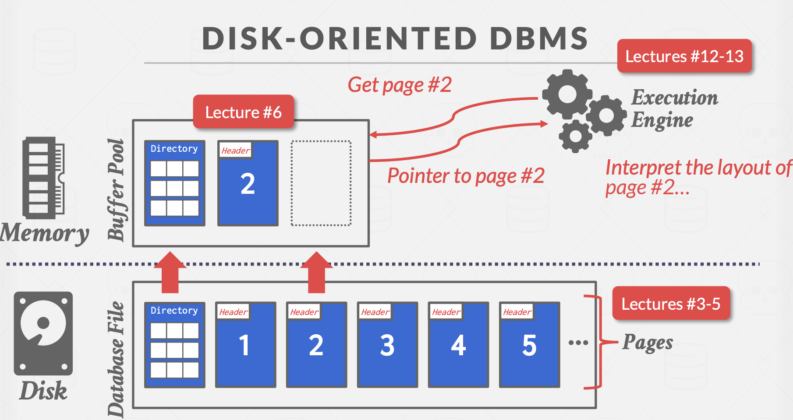

### 是否使用OS管理

我们为什么不使用OS负责在内存和磁盘之间移动页呢？

A high-level design goal of the DBMS is to support databases that exceed the amount of memory available.
Since reading/writing to disk is expensive, disk use must be carefully managed. We do not want large stalls
from fetching something from disk to slow down everything else. We want the DBMS to be able to process
other queries while it is waiting to get the data from disk.

This high-level design goal is like virtual memory，虚拟内存技术。这个OS可以提供。

One way to achieve this virtual memory is by using `mmap` to map the contents of a file in a process’ address space, which makes the OS responsible for moving pages back and forth between disk and memory.
Unfortunately, this means that if mmap hits a page fault, the process will be blocked.

What if we allow multiple threads to access the mmap files to hide page fault stalls?
This works good enough for read-only access. It is complicated when there are multiple writers

下图为虚拟内存的原理，以及遇到页错误，page2无法加载到物理内存中，所以DBMS进程受阻，DBMS想要page2

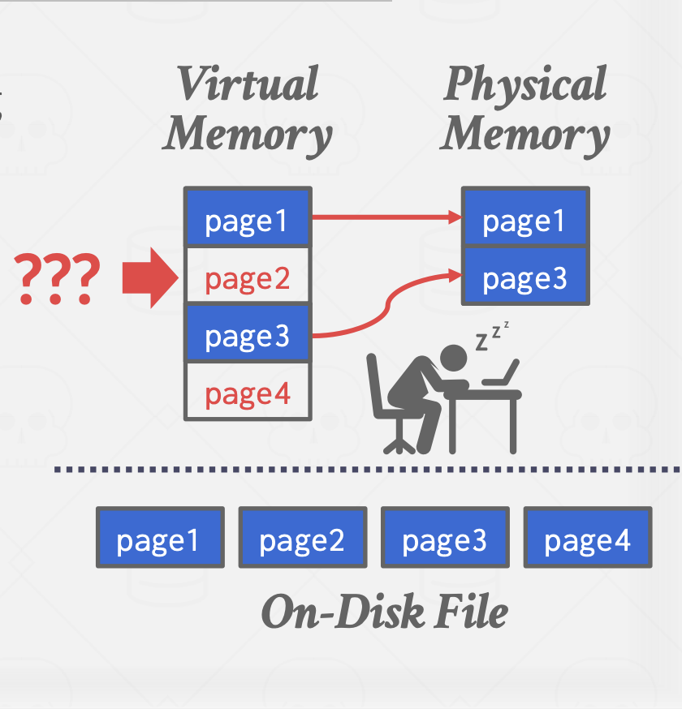

除此之外，使用OS的mmap还会存在以下冲突

* Transaction Safety(应该是并发安装之类的)。 操作系统会在任意一个可能的时刻刷新dirty page
* I/O Stalls: DBMS doesn't know which pages are in memory. The
OS will stall a thread on page fault.
* Error Handling: Difficult to validate pages. Any access can cause a SIGBUS
that the DBMS must handle.
* Performance Issues: OS data structure contention. TLB shootdowns

当然除了mmap，我们仍有其他方法使用OS实现并解决上述问题

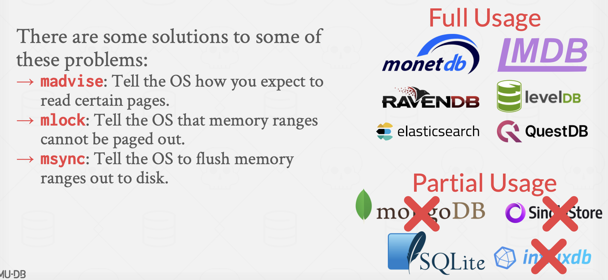

Even though the system will have functionalities that seem like something the OS can provide, having the
DBMS implement these procedures itself gives it better control and performance.

### File Storage

How the DBMS represents the database in files on disk

可以由大到小分为三个层面：File Storage，Page Layout， Tuple Layout

在磁盘上存取数据是以页/块的形式的。DBMS负责管理数据文件，组织文件以页的形式管理。而数据库使用的页的大小和操作系统的不一定一致，一般为了方便，总是取整数倍关系。

对于操作系统的页的大小总是固定的，Pages can contain different kinds of data. Most systems will not mix these types within pages. Some systems will require that pages are self-contained, meaning that all the information needed to read each page is on the page itself.

Each page is given a unique identifier. If the database is a single file, then the page id can just be the file offset. Most DBMSs have an indirection layer that maps a page id to a file path and offset.

The storage device guarantees an atomic write of the size of the hardware page. If the hardware page is 4 KB and the system tries to write 4 KB to the disk, either all 4 KB will be written, or none of it will. This means that if our database page is larger than our hardware page, the DBMS will have to take extra measures to ensure that the data gets written out safely since the program can get partway through writing a database page to disk when the system crashes.

Different DBMSs manage pages in files on disk in different ways.

* Heap File Organization
* Tree File Organization
* Sequential / Sorted File Organization (ISAM)
* Hashing File Organization

以堆文件组织为例子，A heap file is an unordered collection of pages where tuples are stored in random order.

The DBMS can locate a page on disk given a page id by using a linked list of pages or a page directory

Linked List：使用指针指向数据页链表和空闲页链表，缺点也是链表的缺点，只能顺序读写

Page Directory：（有点想文件夹系统）使用一个特殊的页维护追踪所有数据页，如下图

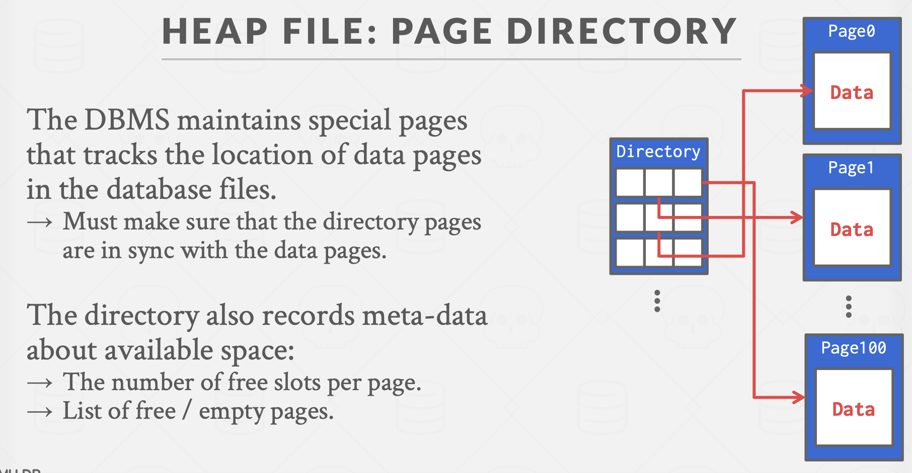

### Page Layout

每一个页由Header和Data组成。页的头会记录：

* Page Size
* Checksum
* DBMS version
* Transaction visibility 这个不太了解，可能是和并发相关
* Compression Information
* Self-containment. (Some systems like Oracle require this.)

页存储数据的模式，两种。Tuple-oriented和Log-structured。

这里先说明Tuple-oriented
存元组的方式为Slotted Pages。槽化页（也许是这么翻译的

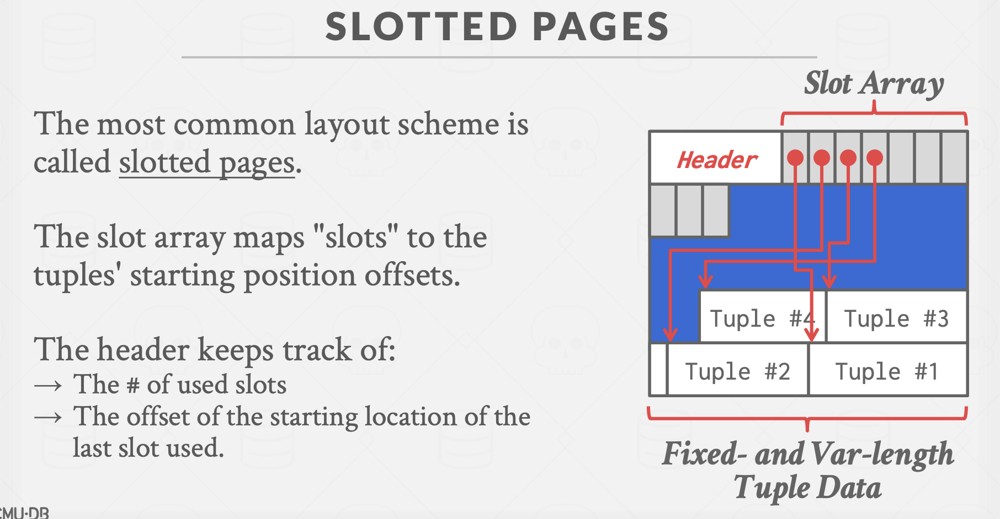

槽是顺序排列的，每个槽存一个元组的偏移量，元组就是可变长的，也是可以移动整理的。

每一个元组都有一个自己的ID，叫record identifier。一般这个id对应用程序是不可见的，因为会随时整理元组在页中的分布，所以给外部的应用程序展现的是另一种id

如何去插入一个新的元组：Check page directory to find a page with a free slot. Retrieve the page from disk (if not in memory). Check slot array to find empty space in page that will fit.

### Tuple Layout

A tuple is essentially a sequence of bytes.

Each tuple is prefixed with a header that contains meta-data about it.

* Visibility info (concurrency control)
* Bit Map for NULL values. 因为元组里的数据是顺序的，所以你在解析的时候需要知道，那个字段有没有是null值的可能，不然解析的时候可能会把另一个字段的值解析到应该为null值字段上。

一般来说元组的数据是这样的

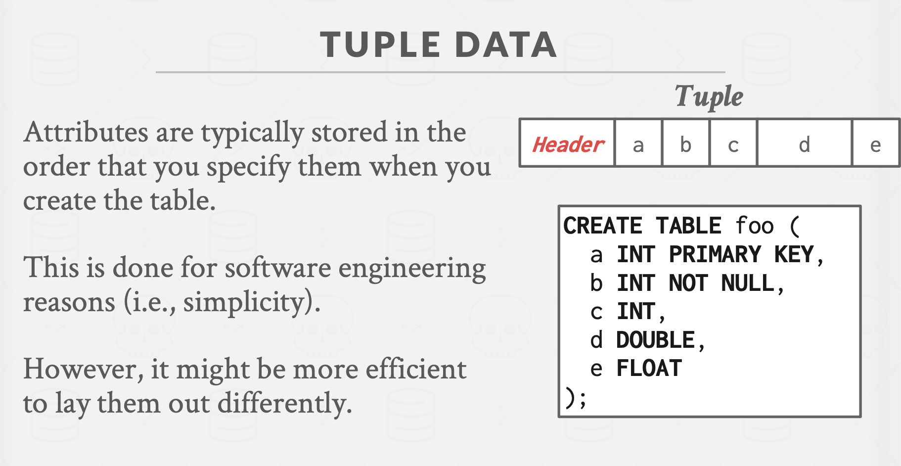

当然也有一些奇怪的设计。DENORMALIZED TUPLE DATA。一个想法，用户在查询两个有高关联性的表，那我们在存的时候直接把两个表的数据和在一起，这样不就减少I/O了吗。想法很好，实际上问题很多，即使减少了I/O，却为数据的管理造成了很大的影响。

## Log-Structured

日志一般用于kv数据库之前实现过Raft，所以比较清楚。
Tuple-oriented有一些缺陷：

* Fragmentation: Deletion of tuples can leave gaps in the pages.
* Useless Disk I/O: Due to the block-oriented nature of non-volatile storage，the whole block needs to be read to fetch a tuple. 这里意思是要获取某个tuple，要先将整个页载入内存，然后在查找，而之后我们不需要其他元组，这就造成了无效的I/O。
* Random Disk I/O: 如果想拿到很多个不在同一个页中的元组，就要载入多少个不同的页，差不多就是随机读取的性能了

Log-Structured适用于kv型数据库。What if we were working on a system which **only allows creation of new data and no overwrites**? The log-structured storage model works with this assumption and addresses some of the problems listed above.

每一个日志项和一个元组相关联，只记录对元组的PUT，DELETE操作，如果要查询某一个key对应的值，只需要查询最新的与之关联的日志项即可。对元组的删除操作只是把元组标记为deleted。日志项只允许有在尾部进行Append操作。页中的日志项是按时间排列的。

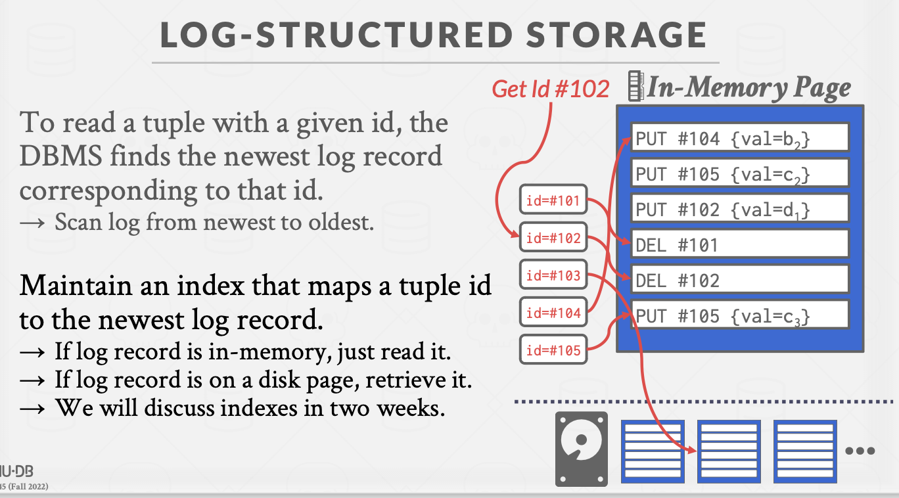

当然如果日志过大，执行日志压缩即可。这里的压缩和Raft基本差不多。把所有和元组有关的页压缩。在压缩完成后，DBMS还要维护页中的日志项的时间顺序正确性。
The DBMS can instead sort the page based on id order to improve efficiency of future look-ups. Called Sorted String Tables (SSTables) (意思是说，压缩后，有些日志项的时间顺序其实已经是一样的了，然后可以再按照元组的id排序，提高之后查找的效率)

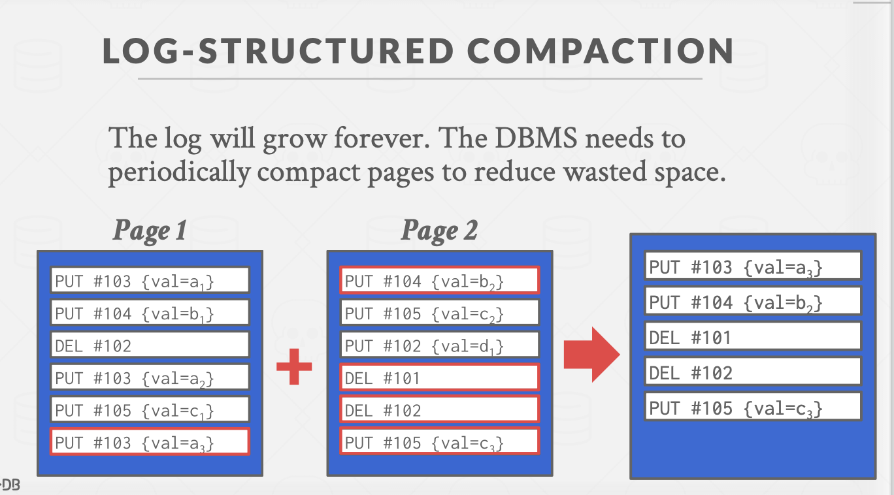

日志压缩的方法大体分为：通用压缩（Universal Compaction），层级压缩（Level Compaction）

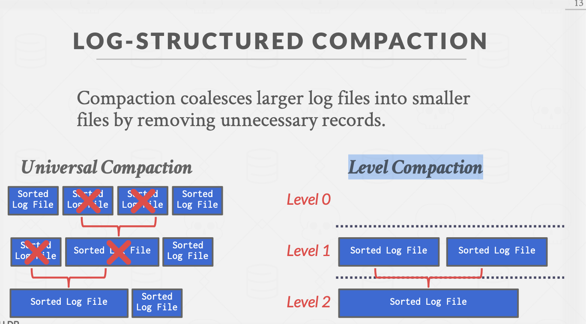

层级压缩RocksDB在用。

采用日志结构化有一个很大的优点就是写的速度非常快，比读的速度快十几倍，因为向硬盘里写入的使用都是顺序写入页，而页只允许尾部的append操作，减少了很多随机的I/O访问。

## Data Representation

元组中的数据如何表示。

DBMS不能直接存某些数据。比如一个浮点数。以下代码

```cpp
#include <iostream>

int main() {
  float x{0.1F}, y{0.2F};
  std::cout << x + y << std::endl;
  std::cout << 0.3 << std::endl;
  std::cout.precision(20); 
  std::cout << x + y << std::endl;
  std::cout << 0.3 << std::endl;
}
```

输出为

```plain
0.3
0.3
0.30000001192092895508
0.2999999999999999889
```

有精度损失。不可接受的，一般处理浮点数，在很重要的地方的，绝对不能用`float`等，一般用特殊化的结构去算。

### Large Vaules

Most DBMSs don't allow a tuple to exceed the size of a single page.

To store values that are larger than a page, the DBMS uses separate
Overflow Page.

### External value storage

不建议存

## SYSTEM CATALOGS

A DBMS stores meta-data about databases in its internal catalogs.

DBMS存CATALOGS也是通过datebase去存的。

You can query the DBMS’s internal INFORMATION_SCHEMA catalog to get info about the database.

```sql
SELECT *
FROM INFORMATION_SCHEMA.TABLES
WHERE table_name = 'student'
```

## Database Workloads

数据库的工作流，不同的工作流也影响着我们数据库的策略

* **OLTP: Online Transaction Processing**: An OLTP workload is characterized by fast, short running operations, simple queries that operate on single
entity at a time, and repetitive operations. An OLTP workload will typically handle more writes than reads. 特征就是数据量小，更倾向于写操作。例子：用户购物

* **OLAP: Online Analytical Processing**: An OLAP workload is characterized by long running, complex queries, reads on large portions of the database. In OLAP worklaods, the database system is analyzing and deriving new data from existing data collected on the OLTP side. 数据量大

* HTAP: Hybrid Transaction + Analytical Processin: A new type of workload which has become popular recently is HTAP, which is like a combination which
tries to do OLTP and OLAP together on the same database.

负载图
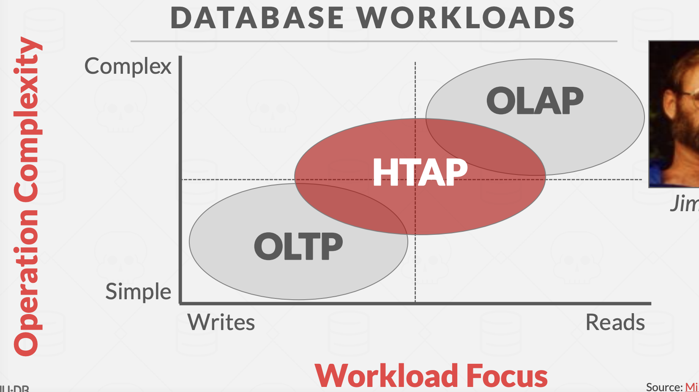

## Data Storage Models

The DBMS can store tuples in different ways that are better for either OLTP or OLAP workloads.

之前讨论的时候都是假设我们采用行存储模式。n-ary storage model

所以先讨论n-ary storage model吧

### N-Ary Storage Model (NSM)

In the n-ary storage model, the DBMS stores all of the attributes for a single tuple contiguously in a single page.

一整行数据存到一个页里。比较适合OLTP，因为OLTP的数据操作通常是针对整行数据的。不说话OLAP，OLAP可能只是想分析表中的某几个项，如果用行存的话，会加载太多页。

* Advantages: Fast inserts, updates, and deletes. Good for queries that need the entire tuple

* Disadvantages: Not good for scanning large portions of the table and/or a subset of the attributes

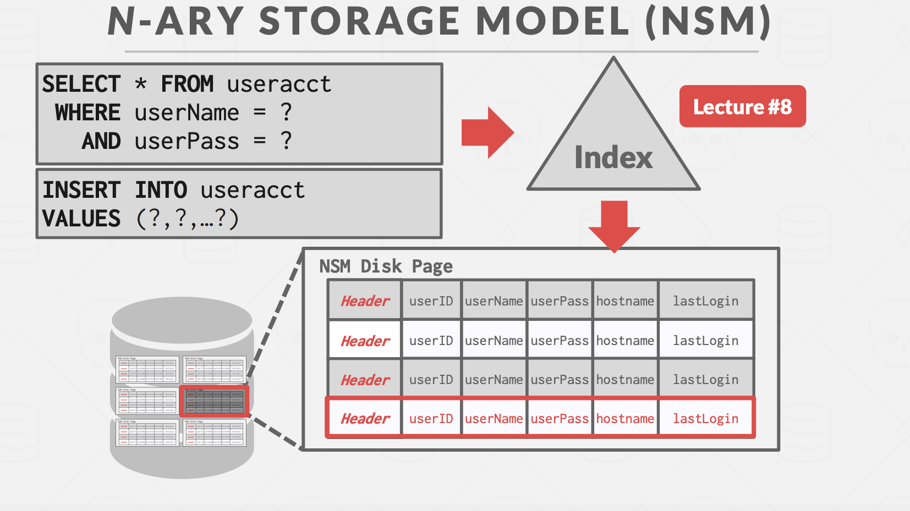

### Decomposition Storage Model (DSM)

把列存到一个页中。“column store.”

适用于OLAP，大量的只读操作获取表的属性的子集

* Advantages: Reduces the amount of I/O wasted because the DBMS only reads the data that it needs for that query. Better query processing and data compression

* Disadvantages: Slow for point queries, inserts, updates, and deletes because of tuple splitting/stitching.

那问题在于我们怎么去找到数据呢

常用的方法是fixed-length offsets. 给予一个数据定长，这样就能用偏移量算出来了。比如要找第3个元组的k属性的数据，先找到存k的页，然后第3乘偏移量就能得出k的位置了。

还有一个方法叫embedded tuple ids。每一个列都存一个tuple的id，这样就能有区别了。

## Database Compression

数据库压缩，减少数据占的空间，从而减少磁盘的I/O操作。提升速度

In-memory DBMSs more complicated since they do not have to fetch data from disk to execute a query. 内存的DBMS比较看重的是CPU的执行时间，所以一般压缩的话比较看重速度而不是压缩率。

之所以能压缩呢，If data sets are completely random bits, there would be no ways to perform compression. However, there are key properties of real-world data sets that are amenable to compression: Data sets tend to have highly skewed distributions for attribute values. Data sets tend to have high correlation between attributes of the same tuple.

压缩数据库要保证

* Must produce fixed-length values. The only exception is var-length data stored in separate pools. This because the DBMS should follow word-alignment and be able to access data using offsets.
* Allow the DBMS to postpone decompression as long as possible during query execution (late materialization
* Must be a lossless scheme because people do not like losing data. Any kind of lossy compression has to be performed at the application level.

### 压缩粒度

* Block Level: Compress a block of tuples for the same table
* Tuple Level: NSM only
* Attribute Level
* Columnar Level: (DSM only). This allows for more complicated compression schemes.

### 压缩技术 TODO

先列个List吧，以后补上

1. Naive Compression
2. Run-Length Encoding
3. Bit-Packing Encoding
4. Mostly Encoding
5. Bitmap Encoding
6. Delta Encoding
7. Incremental Encoding
8. Dictionary Compression ： The most common database compression scheme is dictionary encoding.
