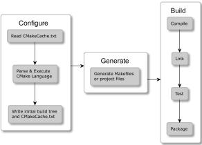
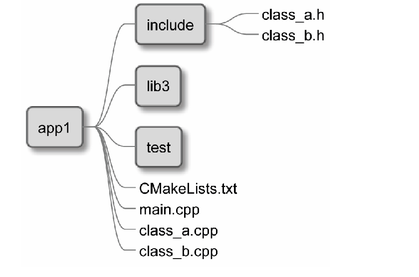
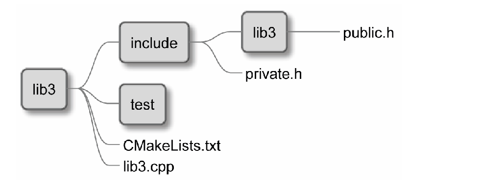

# Section 1: Start

These are my note for 《Modern CMake for C++》

CMake is a building software. Building software is a very versatile process and can span multiple different aspects:

* Compiling executables and libraries
* Managing dependencies
* Testing
* Installing
* Packaging
* Producing documentation
* Testing some some

## Basic concept

### How does CMake work

There are three stages for CMake to process source code.

* Configuration
* Generation
* Building

The configuration stage

This stage is about reading project details stored in a directory, called the source tree, and preparing an output directory or build tree for the generation stage.

The generation stage

Buildsystems are simply cut-to-size configuration files for other build tools (for example, Makefile for GNU Make or Ninja and IDE project files for Visual Studio). During this stage, CMake can still apply some final touches to the build configuration by evaluating generator expressions.

The building stage

To produce the final artifacts specified in our project, we have to run the appropriate build tool.



### Mastering the command line

Generating a project buildsystems: This is the first step required to build our project.

```shell
cmake [<options>] -S <path-to-source> -B <path-ro-build>.
```

Options for generators: you can specify a few options during the generation stage. Selecting and configuring a generator decides which build tool from our system will be used for building, what build files will look like, and what the structure of the build tree will be.

```shell
cmake -G <generator-name> <path-to-source>
```

to be completed

### Building a project

```shell
cmake --build <dir> [<options>] [-- <build-tool-options>]
```

In the majority of these cases, it is enough:

```shell
cmake --build <dir>
```

> Many online sources recommend running GNU Make directly after the generation stage: make. This is a default generator for Linux and macOS, and it usually works. However, we prefer the method described in this section, as it is generator-independent and is supported across all platforms. As a result, we don't need to worry about the exact environment of every user of our application.

parallel builds:

```shell
cmake --build <dir> -j [<number-of-jobs>]
```

## Navigating the project files

* The source tree
    This is the directory where your project will live (it is also called the project root). It contains all of the C++ sources and CMake project files.
* The build tree
    CMake uses this directory to store everything that gets generated during the build: the artifacts of the project, the transient configuration, the cache, the build logs, and anything that your native build tool will create.
* list_files
* CMakeLists.txt
* CMakeCache.txt

### The Config-files for packages

A big part of the CMake ecosystem includes the external packages that projects can depend on.

### Command invocations

Command names aren't case-sensitive, but there is a convention in the CMake community to use snake_case in command names.

What's especially striking in comparison to C++ is the fact that command invocations in CMake are not expressions. You can't provide another command as an argument to a called command, as everything between the parentheses is interpreted as an argument for that command.

CMake commands don't require semicolons at the end of an invocation. So, these are the only allowed formats:

```cmake
command(argument1 "argument2" argument3) # comment
```

the only data type recognized by CMake is a string.
CMake offers three types of arguments:

* Bracket arguments
    Bracket arguments aren't evaluated because they are used to pass multiline strings, verbatim, as a single argument to commands.

```cmake
message([multiline bracket argument
    ${string}
])
```

you can also use `[==[]==]` replace `[]` when the text contains `[]`.

These kinds of bracket arguments have limited use – typically, to contain longer blocks of text. In most cases, we'll need something more dynamic, such as quoted arguments.

* Quoted arguments

    Quoted arguments resemble a regular C++ string.
    wrap the name of variable: `${name}`
    these arguments group together multiple characters, including whitespace, like backslash`\"`

* Unquoted arguments

### TODO

* CMake with variable

## Main: Set up your first CMake Project

```cmake
cmake_minimum_required(VERSION 3.20)
project(Hello)
add_executable(Hello hello.cpp)
```

this is a simple example.

### Partitioning your project

<https://cmake.org/cmake/help/latest/guide/tutorial/index.html> to Step 3: Adding Usage Requirements for a Library

## Thinking about the project structure


This project outlines the directories for the following components:

* cmake: Includes macros and functions, find_modules, and one-off scripts
* src: Will store the source of our binaries and libraries
* doc: Used for building the documentation
* extern: Configuration for the external projects we are building from source
* test: Contains code for automated tests

In this structure, the CMakeLists.txt file should exist in the following directories:
the top-level project directory, src, doc, extern, and test. The main listfile shouldn't declare any build steps on its own, but instead, it should use the add_subdirectory() command to execute all of the listfiles in the nested directories. In turn, these may delegate this work to even deeper layers if needed.


This is how your file tree might look for a single target:



what a library looks like:



As it turns out, libraries follow the same structure as executables, with only a small difference: there is an optional lib3 directory in the include directory. This should only be present if we use the library externally from the project. It provides the public header files that other projects will consume during compilation. We'll return to this subject when we start building our own libraries in Chapter 5, Compiling C++ Sources with CMake.
