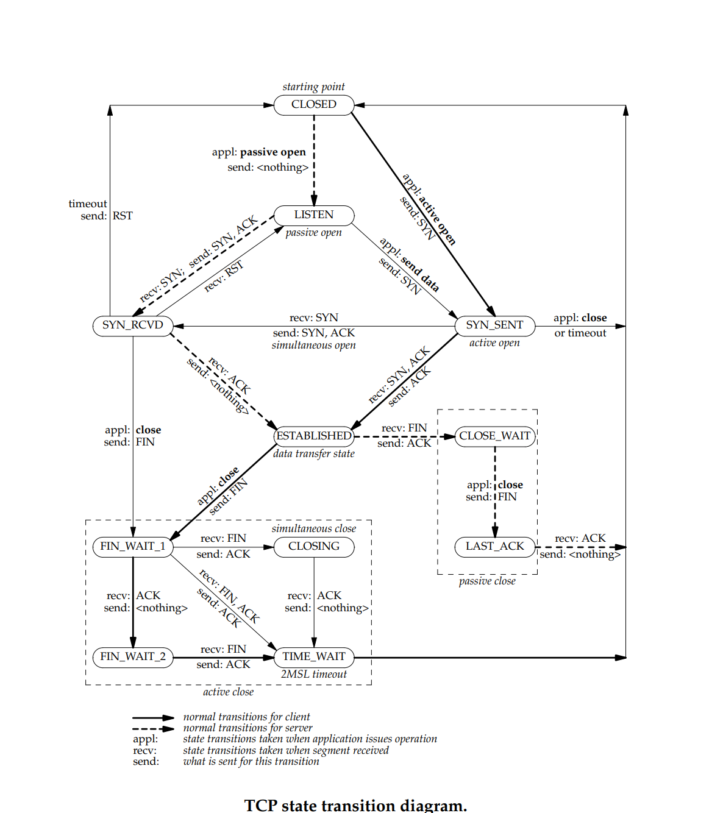

# Lab4

Implement the TCPSConnect

> Hint:
>
> 1. You don’t need to make more state variables to keep track of this. The “state” is just a function of the public interface your modules are already exposing. Exmple: Receiver state: `TCPState::state_summary(_receiver)` it will return `TCPReceiverStateSummary`.
>
> 2. You don't need to send seg with `RST` flag set while receiving a seg with `RST` flag set or called destructor function.
>
> 3. Flag rst is ingored when the state of reciever is LISTEN.

## TCP state transition

## Pineline

### ESTABILSH

There are two peers.

***Client***: active open.
***Server***: passive open.

Client === SYN ===> Server: Server's receiver has ack after this case.

Server === SYN ACK ===> Client: Client's receiver has ack after this case.

Client === ACK ===> Server: the TCP connect is established.

### TRANSFER

Peer A <=== ACK ===> Peer B

### CLOSE

#### Clean shutdown

> active() == false without an error.

There are two peers.

***Client***: active close.

***Server***: passive close. ( if the TCPConnection’s inbound stream ends before the TCPConnection has ever sent a fin segment, then the TCPConnection doesn’t need to linger after both streams finish.)

Client === FIN ===> Server

Server accepts FIN. Server is in `CLOSE_WAIT`.
Server will passive close while receiving ACK(the client ackonladges the FIN sent by the server) at once.

Client will be in `TIME_WAIT` when it end up the receiver's stream.
Client will keep the connect unitl it has been at least 10 times the initial retransmission timeout in `TIME_WAIT`.

Why?

先用中文吧。
首先4个前提：

1. `in_stream` has ended. (Local receiver)
2. `out_stream` has ended. (Local sender)
3. Local发送的所有数据包括FIN都已经被remote所确认
4. Local确信remote能够满足前提3。这个可能比较绕：Local确信remote知道remote发送的所有数据包括FIN已经被local确认

前三个前提很好判断。第4个有两种情况。
第一种：Local是passive close一方。Local是先收到FIN信号，并且local还确认了这个FIN信号。那么在此之后local就会自动满足前提4，因为Local在此后发送的ACK中的序号肯定是大于等于ACK(FIN)这个信号的，所以local在收到remote确认local发送的FIN信号后就可以直接关闭连接。
第二种： Local是active close一方。Local先发送FIN信号，那么在前提1和前提3满足后，local不能确定remote是否能够满足前提3，因为在remote收到local确认remote的FIN的ACK信号后，remote就不会发送ACK。所以local需要等待一段时间去确认remote已经满足前提3，因为如果remote不满足前提3，remote就会继续发送ACK。

### Unclen shutdown

* Destructor
* Received the seg wit flag RST set
* If the sender has sent too many consecutive retransmissions without success

## Challenge

For me, it is to find the bugs in `TCPSender`.
I forget a tiny condition.
