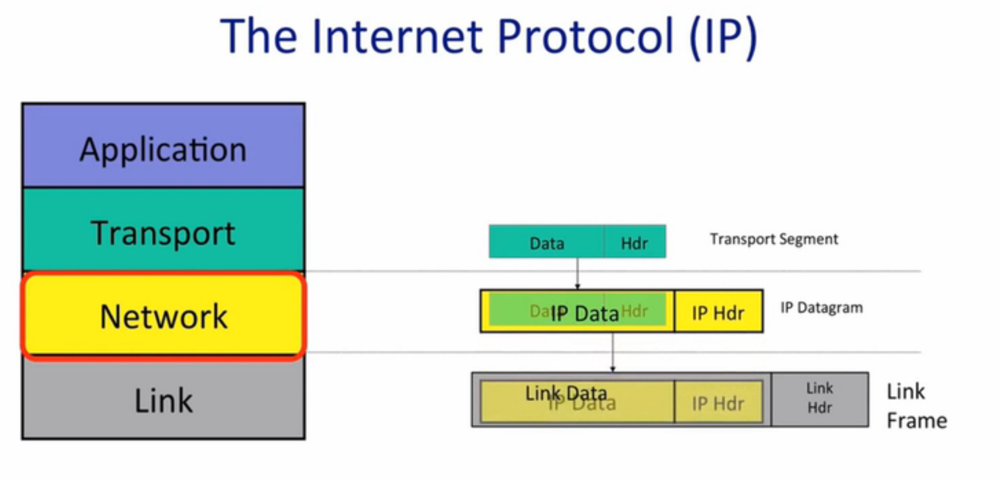

# Week-1

What we learn:

* How an pplication use the Internet
* The structure of Internet: The 4 layer model
* The Internet protocol
* Basic architectual ideas and principles

## Byte System Model

Basic: Bidirectionly connection(reliable)

example:

* Bittorrent: peer to peer
* WWW: HTTP
* Skype: the client behine the NAT

## 4-Layer Model

Appliction selects a protrol

* Link: A packet is delivered hop by hop. Packet is a unit
* Network: Network layer packet is called datagram. Newwork hand the datagrams to the link layer. We must use IP(Best effort, no promises).
* Transport: TCP, UDP and so on. TCP will make sure the data sent at one end of the Internet is correctly delivered.
* Appliction: Reuse transport layer by api.

]

Ip is the thin waist. We have no chocie in Newwork layer.

7-Layer Model(IOS Model)

## The Internet Protrol(IP)

Property: Datagram

IP is a datagram service. The datagram is a packet containing data and header. The header contains the ip address of the destination as ipda. The forwarding decision at the router is based on this ipda. The header also contains an ip source or ipsa for where the packet came from.

Property: Unreliable

Packets might be dropped.

Property: Best effort

Ip makes the promise to only drop packets if necessart such as congestion.

Property: Connectionless

### IP is simple

Following these reason:

* Simple, dumb, minimal: Faster, more streamlined and lower cost to build and maintain.
* The end-to-end principle
* Allow unreliable services.
* Work over any link layer

### IP Details

minimum service.

1. Tries to prevent packets looping forever. TTL: Time to live.
2. Will fragment packets if they are too long.
3. Uses a header checksum to reduce chances of delivering datagram to wrong destination.
4. Allows for new versions of IP(IPv6 IPv4)
5. Allows for new options to be added to header(a bit of mixed blessing)

A line is 4 byte.

* Version: IPv4 or IPv6
* Header Length
* Type of Service: tell router that how important this packet.
* Total Packet Length
* Packet ID:
* Flags:
* Fragment Offset
* TTL: Router will decrem TTL. If it is zero, router will drop this packet.
* Protocol ID: which trasmission protrol
* Checksum
* Soucre IP Address
* Destination IP Address
* Option

## Some detail

simple present.

### TCP Byte Stream

three-way handshake

c send s call: **syn**
s send c call **syn ack**
c send s call **ack**

To open a TCP stream to anpther program we need: IP address, TCP port.

### Inside each Hop

Forwarding table: a set of IP address patterns and the link to send it across for pattern.

## Principle: Packet Switching

Packet: a self-contained unit of data.

Packet Switching: Indepently for each arriving packet, pick its outgoing link.

Packet switching example:

there is a small amount of state which tell switch which next hop in each switch.

When switch receives a packet, it looks up the address in the table and sends it to next hop.

Packet Switching has two consequences:

* Simple packet forwarding
* Efficient sharing of link

## Principle: Layer

focus self jobs

The Reason:

## Principle: Encapsulation

Exmaple-1:

Encapsulation offer flexibility.

Exmaple-2: VPN Serve

## Memory, Byte Order, and Packet Formats

We need union format in Internet.

The Endianness that lay out a multibyte value in memory is different in different processor architecture. We have two options: big endian(the most significant byte is the lowest address) and little ednian(reverse).

We use the big endian in the Internet.

So you have to convert properly network byte order value to your host order.

## Names and Address: IPv4

it is used in Network Layer.

the original goal of the IP was to take mant different networks and stitch them together. We needed newtwork-independent and unique address.

An IPv4 address identifies a device on the Internet in Network Layer.

IPv4 has 32 bits long: a.b.c.d

Netmask: apply this mask, if it matches, in the same network.

### IPv4 address structure today

In history: network + host: network to get to correct network, host to get device in network.

simple but not flexible.

like: 171.64.0.0 /16. /16 means netmask of length 16.

### IPv4 Address Assignment

the "IP runing out" means that IANA ran out of /8 to give out.

### Longest Prefix Match

Routers use longest prefix match to choose which link to forward a packet over.

Router has a forwarding table.

## Adress Resolution Protocol(ARP)

The ARP is the mechanism by which the network layer can discover the link address associated with a network address it's directly connected.

I have an IP. Packet whose next hop is address. What link address should I send it to.

ARP is needed because each protocol layer has its own name and address.

IP address means "this host" in internet layer, while an enthernet address mean "this enthernet card" in link layer.

Consdiering: A want to send a packet to B. A know IP: 171.43.22.5 is in different network, so it need send the packet through the geteway. Then, the packet has a network layer destination 171.43.22 and a link layer destination 0:18:e7:f3:ce:la which is gateway, and alse has a network source and a link source. The gateway will drop the link data and put the IP packet inside a link layer frame to B.

This is the problem wanted to be solved by ARP.

A client wants to send a packet to gateway(192.168.0.1), so how can it do to get a link layer address associated with gateway. We use ARP.

