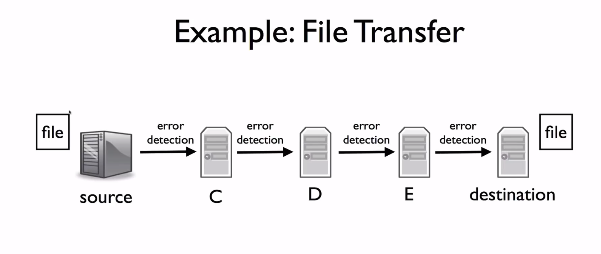

# Week-2 Transmission Layer

## UDP Model Service

> You can see checksum uses the IPv4 from the below layer to calculate in this picture. That against the layering principle. The reason is that it allows UDP to detect datagram that were delievered to the wrong destination.

UDP is simple protrol for sending data from one host that is possible to missing to a remote host.

Its work process:

### UDP Property

Self contianed datagrams means the application need to sort the datagram from UDP to be correct sequence.

Use UDP Example: DNS, DHCP and so on.

## ICPM

Internet Control Message Protrol is used to report erros and diagnose problem with the network layer.

Here is network layer:

ICPM is unreliable service.

Example: ping, traceroute.

## The End-to-End Principle

Think about this:

The network dosen't implement these for **The End-to-End Principle**.

I don't understand the concept, but I can view the examples.

As the follow:

We want to send the file from source to destination. We implement the method that network will be sure the file won't corrupted on network. So someone like D receives the data from C and thinks it's OK to transfer to next. But the problem is that the wrong file will be sent and accepted by destination if C occur some errors such as bit reverse.

The only way to make sure the file is safe is to perform an end-to-end check.

But network can provide some help such as wireless.

## Error Detection: 3 Schemes

Checksum, CRC and MAC(not Error Detection)

waiting

## TCP

### Flow Control

The aprroach:

* Don't send more packets than receiver can process.
* Receiver give sinder feedback.

Two basic way: Stop and Wait and Sliding Window

#### Sliding Window

#### Go-Back-N

The sliding window sender

The sliding window receiver

Be careful for these:

* Ack is a cumulative signal
* TCP acks are next expect data.

And we should consider that how much sequence space we need.

* First the question: what is sequence space?
Answer: sequence number is used to represent the sequence of segment. A data can be divided to plenty of segments that is marked by sequence number in sequence(e.g, [0,1,2,..., end_seq]). A set of sequence number is called sequence space.
* Considering the condition: SWS equals to a and RWS equals to b(We suppose that b le a). If sequence space is [0,..., y]. Sender have sent [0, ..., x-1] segments and been acknowlegdement. Then sender send [x, ..., y] and [0, ..., z] segments. Receiver receives them successfuly and it's next expects [z+1]. Unfortantly the acks [x+i, ..., y] and [0, ..., z] are missing, so send will resend [x + 1, ..., y], [0, ..., z] and send [z+1, ..., z+i]. Receive will accept [z+1, ..., z+i] expecting [z+1], then it will expect [z+i+1]. If number $x + 1 <= z + i + 1 <= y$, the thing gets a mess.
* Generally we need SWS + RWS space.

#### Select Resend

### TCP Flow control

* Allow a window of unacknowlegde packet in flight
* When acknowlegdement arrives, advance window
* Require sequence number space size depend on window size
* TCP acks are next expect data.
* TCP uses Selective acknowledgment. (I guess I still can use Go-Back-N in labs)
* the detail about sequence number is in lab2.

### TCP Set up and teardown

this picture can explain most thing. some tiny detail is told about in lab2 lab3 and lab4.
