# Packet Switching

## Introdution

History: pass it.

Circuit Switching VS Packet Switching

Circuit Switching:

Each call has its own private, guaranteed, isolated data rate from end-to-end.

the problem:

* Inefficient: Internet communication is bursty.
* Diverse Rates
* State Management:

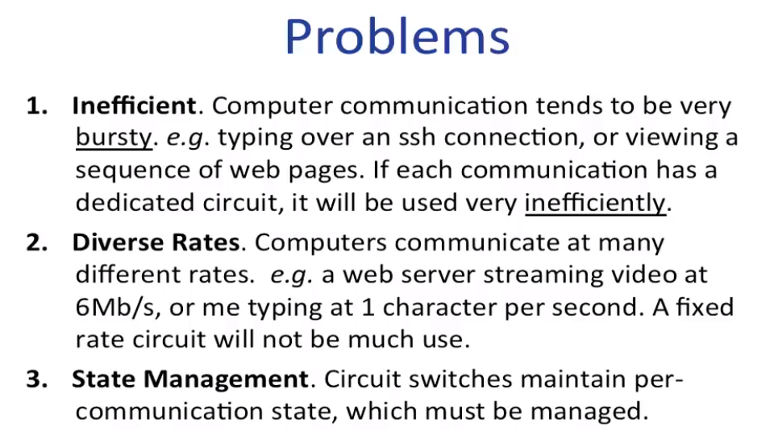

Packet Switching:

* Packets are routed individually.
* All packets share the full capacity of a link.
* The router maintain no per-communication state.

the advantage:

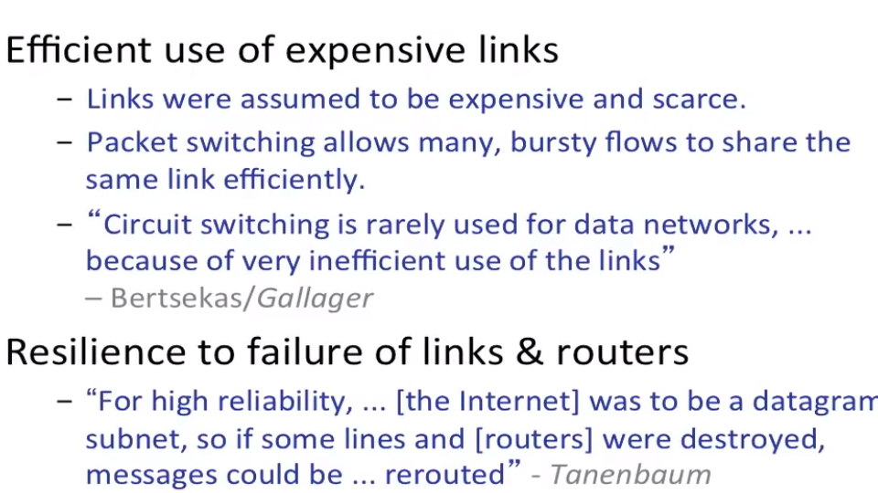

### Useful defination

1. Propagation delay:
$$
t_l = \frac{l}{v}
$$
It means the time spends a bit to traveling over link .

2. Packetization delay:
$$
t_p = \frac{p}{r}
$$
The time from when the first to the last bit of a packet is transmittd.
`p` is the size of packet. `r` is speed of packeting.bits/s

**Be careful:**

A 1kbit packet takes 1.024s to be transmitted onto a 1kb/s link.

`1kbit = 1024 bit` but `1kb/s = 1000 bit/s`

### End-to-end delay

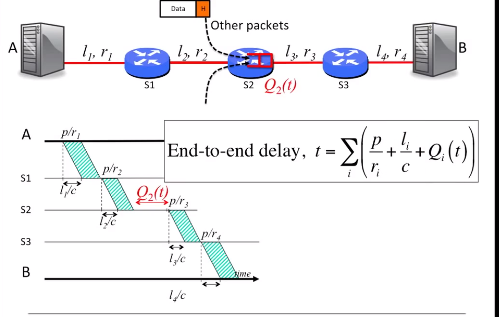

**NOTE**: We don't send the packet until the whole packet is put on the link.

This picture is important. Try to think these cases:

1. if one packet is huge, what dose the image look like?
2. if we split a huge packet to be many small pakcter, what dose the image look like?

Generally, $t_p$ and $t_l$ are deciced, but $Q(t)$ queue dalay in swither is .

### Playback buffer

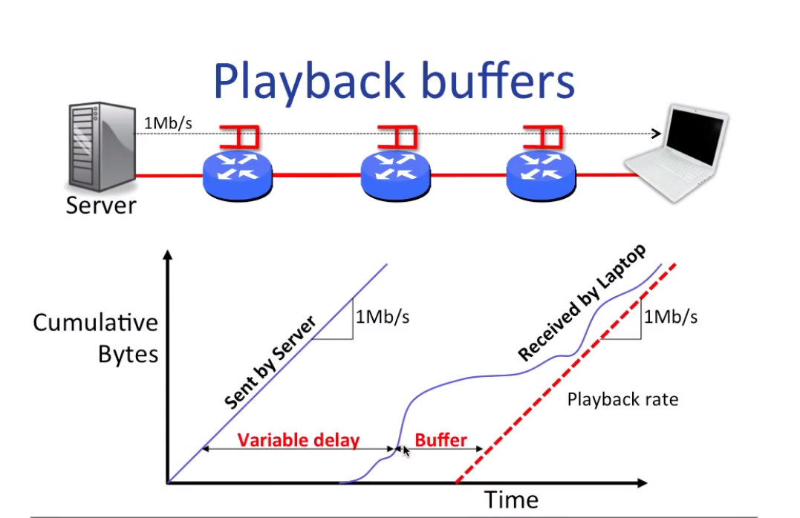

We will make buffer bigger that is called "Rebuffering" if buffer is dificit.

## Queue Model

it is for router queue.

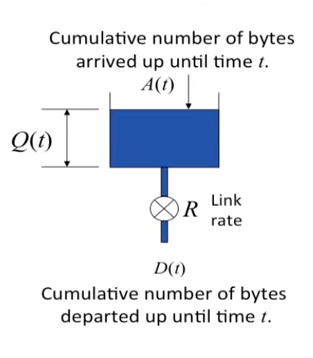

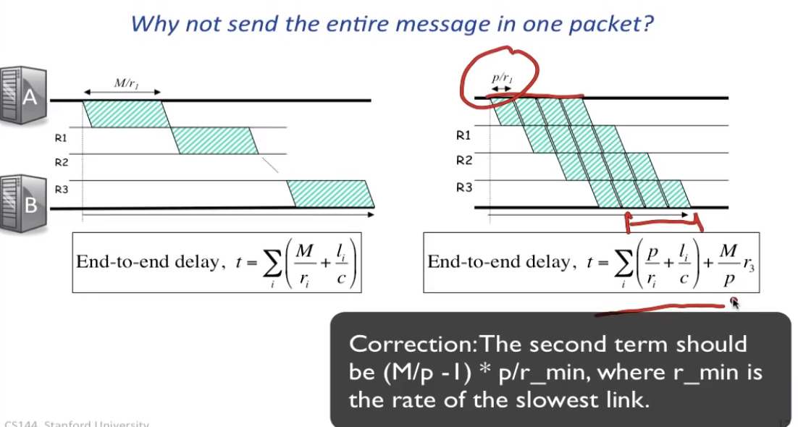

### Statistical Multiplexing

3-5 waitting
TODO

### Useful Properties

Queues with Random Arrival Processes

1. Burstiness increases delay
2. Determinism minimizes delay
3. Little's Result
4. The M/M/1 queue

#### Little's Result

The Poisson process:
$$
P_k(t) = \frac{(\lambda t)^k}{k!} \exp{(-\lambda t)} $$

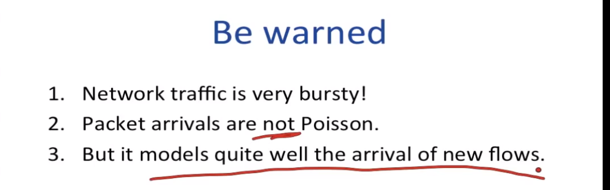

#### M/M/1 queue

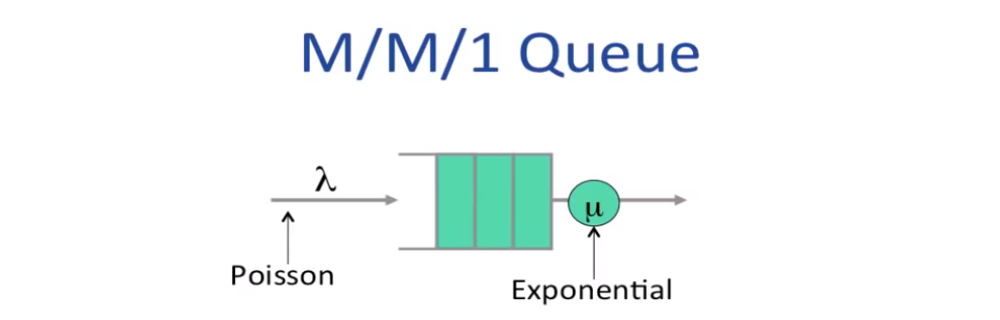

Ref: <https://zhuanlan.zhihu.com/p/90923312>
Conclusion: we need $\lambda <  \mu$

## How work

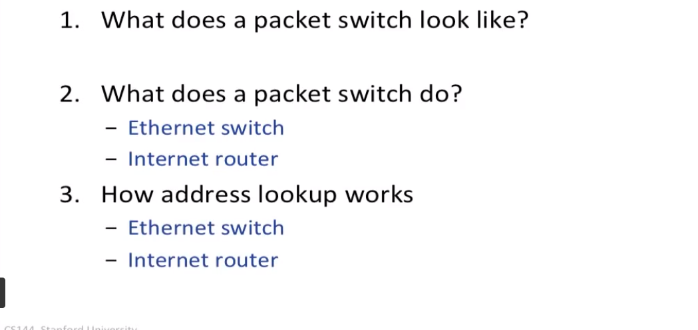

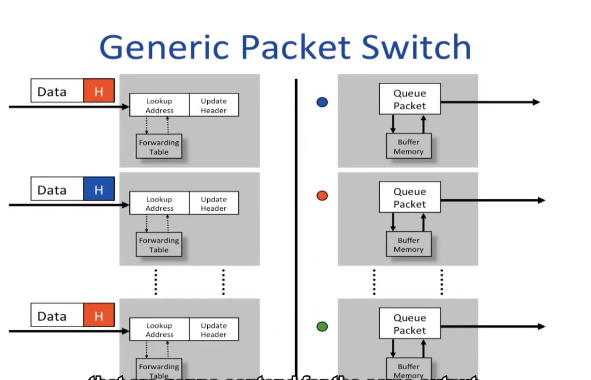

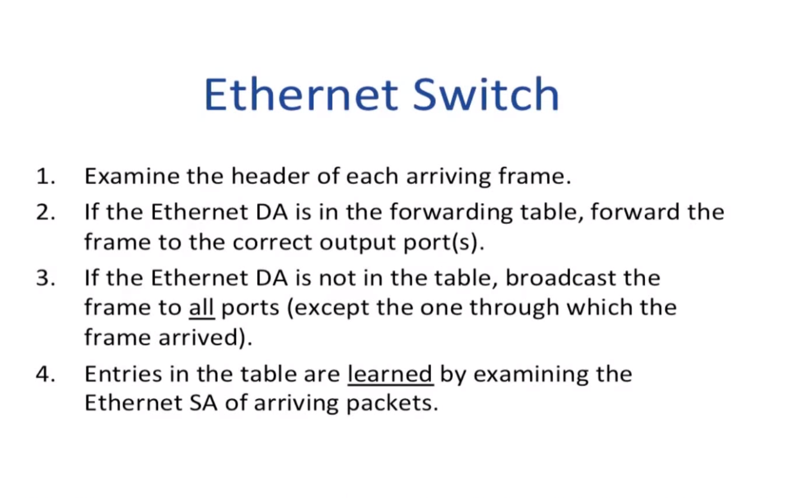

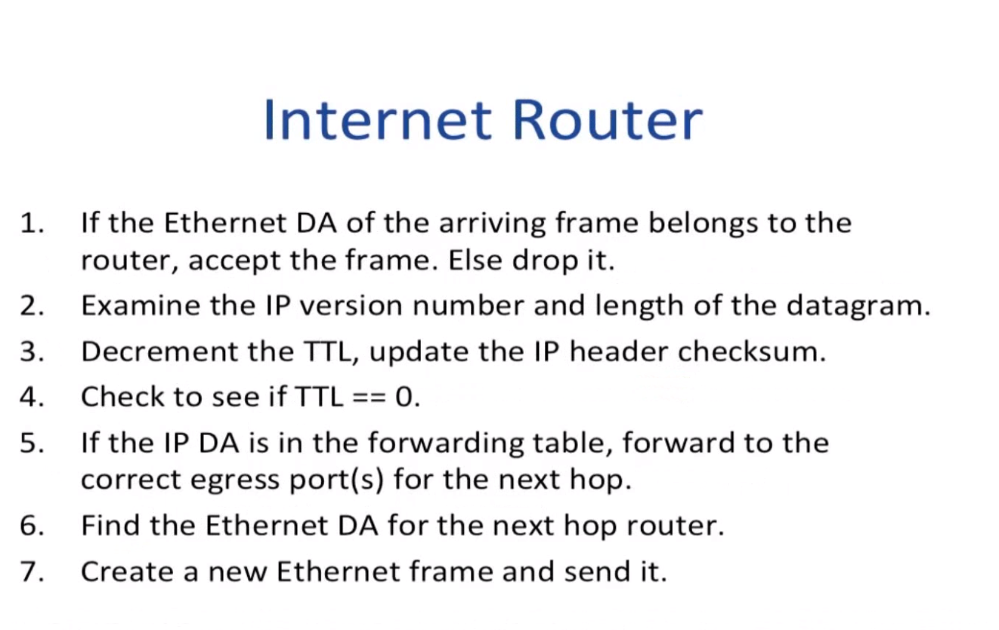

### Forwarding Table

EthernetSwitch: hash table;

InternetRouter: Longest prefix match. Tree or TCAM
